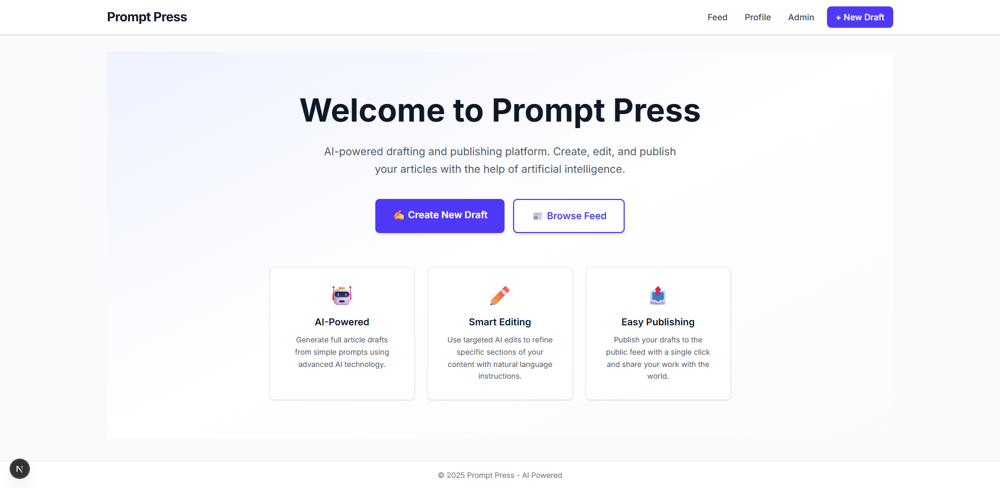
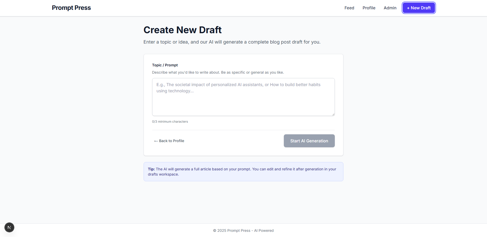
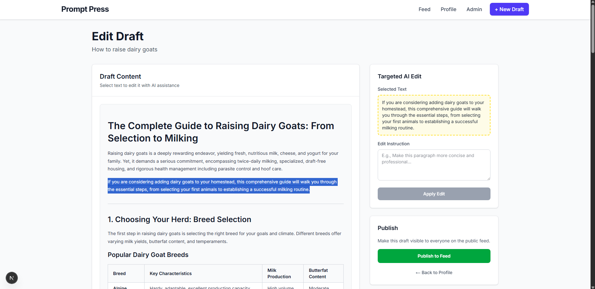
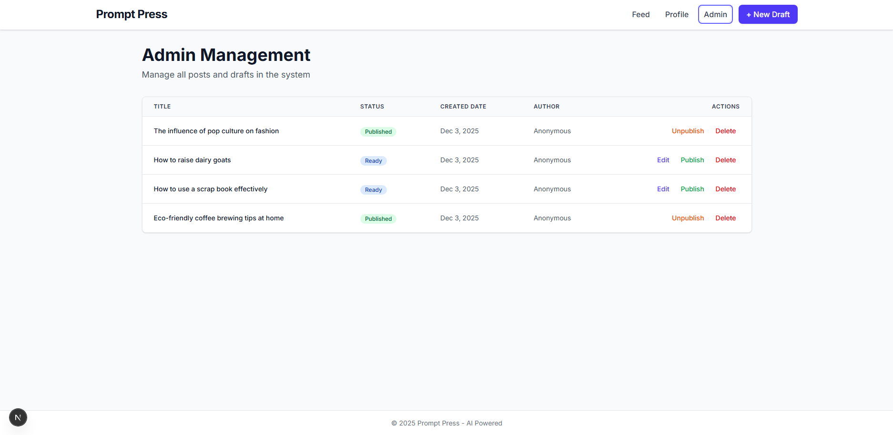

# PromptPress

An AI-powered blog generation and editing platform that helps users create, refine, and publish high-quality blog posts using Google Gemini AI.

## 📖 Description

PromptPress is a full-stack web application that streamlines the blog creation process. Users can generate complete blog posts from simple prompts, perform targeted AI-powered edits on specific sections, and manage their content through an intuitive interface. The platform features a comprehensive admin panel, public feed, and full draft management capabilities.

## 🛠️ Tech Stack

### Backend
- **Node.js** - Runtime environment
- **Express.js** - Web framework
- **TypeScript** - Type-safe development
- **MongoDB** - Database with Mongoose ODM
- **LangChain** - AI framework integration
- **Google Gemini AI** - Content generation and editing
- **Zod** - Schema validation

### Frontend
- **Next.js 14** - React framework with App Router
- **React 19** - UI library
- **TypeScript** - Type-safe development
- **TailwindCSS** - Utility-first CSS framework
- **React Markdown** - Markdown rendering
- **Axios** - HTTP client

## 🔐 Environment Variables

### Backend (`backend/.env`)

```env
PORT=5000
MONGODB_URI=mongodb://127.0.0.1:27017/blogwebsiteai
GOOGLE_AI_API_KEY=your_google_ai_api_key_here
GOOGLE_AI_MODEL=gemini-flash-latest
GOOGLE_AI_TEMPERATURE=0.7
```

### Frontend (`frontend/.env.local`)

```env
NEXT_PUBLIC_API_BASE_URL=http://localhost:5000/api
```

## 🚀 Installation & Run

### Prerequisites

- Node.js 18+ and npm
- MongoDB (local or Atlas)
- Google AI API key ([Get one here](https://makersuite.google.com/app/apikey))

### Setup

1. **Clone the repository**
   ```bash
   git clone https://github.com/berkay-aktas/PromptPress.git
   cd PromptPress
   ```

2. **Install backend dependencies**
   ```bash
   cd backend
   npm install
   ```

3. **Configure backend environment**
   - Create `backend/.env` with the variables listed above
   - Add your Google AI API key

4. **Install frontend dependencies**
   ```bash
   cd ../frontend
   npm install
   ```

5. **Configure frontend environment**
   - Create `frontend/.env.local` with `NEXT_PUBLIC_API_BASE_URL`

6. **Start MongoDB**
   - Ensure MongoDB is running locally or use MongoDB Atlas

7. **Start the backend server**
   ```bash
   cd backend
   npm run dev
   ```
   Server runs on `http://localhost:5000`

8. **Start the frontend server** (in a new terminal)
   ```bash
   cd frontend
   npm run dev
   ```
   App runs on `http://localhost:3000`

## 📸 Screenshots

### Home Page


### Create Draft


### Edit Workspace


### Public Feed


### Admin Panel


## ✨ Features

- **AI Blog Generation** - Generate complete blog posts from simple prompts
- **Targeted AI Editing** - Select and edit specific sections with natural language instructions
- **Draft Management** - Full CRUD operations with status tracking
- **Publish/Unpublish** - Control content visibility with one click
- **Admin Panel** - Comprehensive management interface for all posts
- **Public Feed** - Browse and search published articles